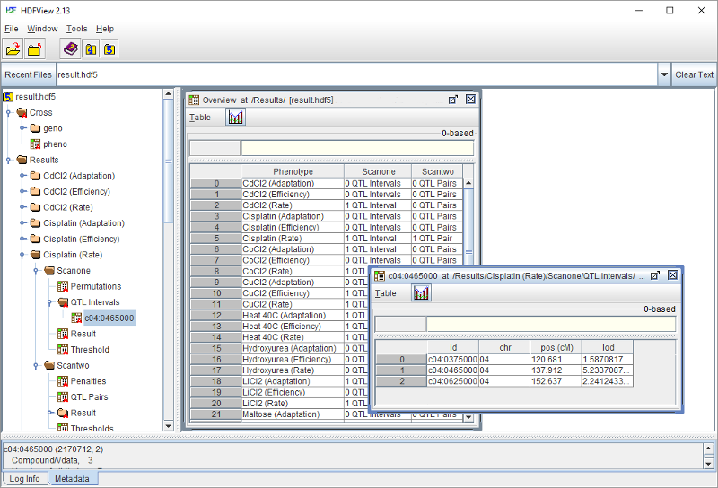
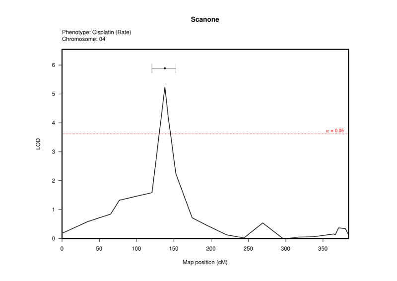
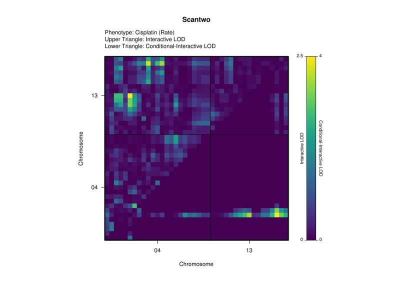

--------------------------------------------------------------------------------

```{r, echo=FALSE}
library(shmootl)
```

# Introduction

The **ShmooTL** package contains pipelines and utilities for QTL analysis of
yeast cross data. Most of the QTL analysis is done by the
[**R/qtl**](https://CRAN.R-project.org/package=qtl) package
[@Broman2003; @Arends2010], and you are strongly encouraged to refer to its
documentation (available [here](http://rqtl.org)), especially the **R/qtl**
manual (available [here](http://www.rqtl.org/manual/qtl-manual.pdf)) and the
[**R/qtl** guide book](http://www.rqtl.org/book) by Broman and Sen
[-@Broman2009].

**ShmooTL** functions can be used in two main ways: high-level
[package pipelines](#package-pipelines) that are designed to be run from the
command line using Rscript, and low-level utility functions that are intended
for use within the R environment. For more information on both types of
function, see the **ShmooTL** package manual.

See the **ShmooTL** package `README` file for instructions on installing this
package and its dependencies.

--------------------------------------------------------------------------------

# Package info

This section outlines key information about the **ShmooTL** package. If you read
this section first, the subsequent sections will be easier to follow.

## Package conventions

The following sections describe conventions in the **ShmooTL** package. Some of
these, such as pseudomarker IDs and default QTL names, follow conventions set by
the **R/qtl** package. Other conventions are used in **ShmooTL**, such as the
encoding of founder genotypes as a concatenation of individual founder alleles.
Because of this, not every valid **R/qtl** cross file is a valid **ShmooTL**
cross file (see [CSV cross file](#csv-cross-file)). However,
following the conventions described in the sections below can enable **ShmooTL**
to identify some dataset features automatically.

### Item IDs

Various items in **ShmooTL** (e.g. chromosomes/sequences, markers, samples,
phenotypes) have an associated identifier (ID). A valid item ID in **ShmooTL**
is a string with one or more characters, containing any combination of printable
ASCII characters (including letters and numbers), except for a single quote ('),
double quotes ("), backtick (\`), comma (,), forward slash (/), or
backslash (\\).

### Syntactic names

A syntactically valid R name contains only letters, numbers, dots, and
underscores. The name should start with a letter, or a dot that is not
followed by a number. In addition, specific reserved words are not
permitted. Many R packages and functions automatically render item names
syntactically valid, so for example, a phenotype name may be changed when
added to an **R/qtl** `cross` object. For more information, see the
relevant [R documentation](https://cran.r-project.org/manuals.html).
See also the base R function `make.names`.

### Chromosomes and sequences

Although for some yeast genome assemblies they are equivalent, chromosomes (cell
structures containing genetic material) are treated by **ShmooTL** as being
distinct from sequences (linkage units that corresponding to all or part of a
chromosome). This distinction is necessary to allow for use of reference genomes
in which multiple sequences map to a single chromosome (see the
[**genomeOpt** function](#function-genomeopt) for more information about setting
a reference genome). While every sequence must be mapped to a specific
chromosome, it is sequences --- and not chromosomes --- that are used as the
primary linkage unit throughout the **ShmooTL** package.

#### Chromosomes

A yeast nuclear chromosome can be represented by an Arabic number in the range
`1` to `16`, inclusive; or by the Roman numeral corresponding to the chromosome
number. The mitochondrial chromosome can be represented by the number `17` or a
capital `M`. A chromosome label can include one of the optional prefixes `c` or
`chr`. So for example, any of the following can represent chromosome 4:

- `4`: an Arabic number
- `IV`: a Roman numeral
- `c04`: a zero-padded Arabic number with prefix `c`
- `chrIV`: a Roman numeral with prefix `chr`

Using the function `normChr`, all of these representations can be normalised to
one consistent form: a zero-padded Arabic number (i.e. `04`). This is used
internally by **ShmooTL** as a normalised representation, and is recommended.

#### Sequences

For genomes in which every sequence represents a specific chromosome, the
sequence label is identical to the chromosome label. In other cases, the
sequence label should be a chromosome label followed by a sequence-specific
label (e.g. contig ID), with the two parts separated by an underscore. For
example, a contig `1D22` that maps to chromosome 4 can be represented as
follows:

- `4_1D22`
- `IV_1D22`
- `c04_1D22`
- `chrIV_1D22`

Variations in chromosome representation are possible as before, but the
sequence-specific label must be consistent. As with chromosomes, the function
`normSeq` can be used to normalise all of these forms to one consistent
representation: a zero-padded Arabic number followed by the sequence-specific
label (i.e. `04_1D22`). This representation is recommended, as it is used
internally by **ShmooTL** as a standard way to label sequences in a genome
in which at least one chromosome is represented by multiple reference sequences.

### Locus IDs

A locus ID used in a genetic or physical map can be any valid
[item ID](#item-ids), and are of two main types: markers and pseudomarkers.
A marker ID is any valid locus ID that is not a pseudomarker ID. Pseudomarker
IDs are used by **R/qtl** for inter-marker loci. They indicate the reference
sequence and genetic map position of the locus, with the two parts separated
by a dot (e.g. `c04.loc33` for a locus at position 33cM on chromosome IV).

Default marker IDs are assigned to loci of a physical map if no other marker ID
is available. These are of the form `c04:0108900`, where `04` is a zero-padded
two-digit chromosome number and `0108900` is a zero-padded seven-digit number
giving the physical map position (in base pairs) of the given locus, with the
two parts separated by a colon.

### QTL names

A QTL name can be any valid [item ID](#item-ids). Default QTL names are of the
form `04@33.0`. As with pseudomarker IDs, this indicates the chromosome and
genetic map position of the QTL, where `04` is a chromosome ID and `33.0` is
the position of the given QTL in centiMorgans.

In a default QTL name, the default precision of the map position is one tenth of
a centiMorgan. As in **R/qtl**, if the step size of a genetic map is smaller than
this, the default QTL name is adjusted to match the appropriate level of
precision.

### Sample IDs

A sample ID can be any valid [item ID](#item-ids). Duplicate sample IDs are
accepted, but only if referring to replicate samples of the same strain.
Different strains can have different numbers of replicates, but samples from a
given strain should be in consecutive rows.

Sample IDs can be used to indicate tetrad membership, even in a `cross` object
with some missing samples. In a tetradic dataset, for sample IDs with a numeric
suffix (e.g. `FS101`), the numeric suffix (e.g. `101`) is interpreted as a
segregant number. In such cases, the segregant number is used to infer the
tetrad to which each sample ID belongs, assuming that tetrads are labelled
sequentially, with four samples per tetrad. Sample IDs can also have an
alphanumeric suffix (e.g. `FS01A`), where the numeric part is a tetrad number
and the final letter (i.e. `A`, `B`, `C`, or `D`) identifies the individual
tetrad member.

### Phenotype IDs

A phenotype ID can be any valid [item ID](#item-ids), although it may be changed
by **R/qtl** to ensure that it is syntactically valid. In such cases, the
original phenotype ID can be obtained from the `info` attribute of a `cross`
that has been loaded with the **ShmooTL** function `readCrossCSV` (see
[**ShmooTL** CrossInfo](#shmootl-crossinfo)).

For a given `cross` object, a set of phenotypes can be designated as a time
series by naming each phenotype with the time point at which phenotype
observations were made (e.g. `0.0`, `1.0`, `2.0`). Time points can be in any
unit, but must be non-negative, increasing, and have a consistent time step.
If some time points are missing, the resulting gap in time must be an even
multiple of the time step.

### Alleles and genotypes

Alleles and genotypes are represented in several different ways within the
**ShmooTL** package.

#### Raw alleles and genotypes

A raw allele is the original marker value. Single-nucleotide variants (i.e. `A`,
`C`, `G`, or `T`) are common, and are the only kind of marker supported by the
**ShmooTL** package. These must be converted into an
[enumerated](#enumerated-alleles-and-genotypes) or
[founder](#founder-alleles-and-genotypes) allele before doing QTL analysis.

For a given ploidy $N$, a raw genotype is the concatenation of the set of $N$
raw alleles. For example, given two `A` alleles at a homozygous diploid marker,
the genotype is `AA`.

#### Enumerated alleles and genotypes

An enumerated allele/genotype is a number representing the order of occurrence
of [raw](#raw-alleles-and-genotypes) or
[founder](#founder-alleles-and-genotypes) genotypes at a specific marker (e.g.
`1` for the first observed genotype, `2` for the second). Enumerated genotypes
are oblivious to genotype ploidy, but are currently restricted to markers with
two observed genotypes; markers with more than two genotype values must be
filtered out and removed. Assignment of enumerated genotype symbols is an
essentially arbitrary process that is done independently at each marker, so a
given enumerated genotype symbol does not have the same meaning across markers.
Because of this, only marker regression can be used for QTL analysis of
enumerated genotypes. Therefore, it is preferable to use founder genotype data,
where possible.

#### Founder alleles and genotypes

A founder allele is a single letter corresponding to a specific founder strain,
indicating that the region containing the marker derives from that founder. For
example, `W` might be used to represent the Western Africa founder strain
`DBVPG6044`, or `S` might be used for the Sake strain `Y12`.

For a given ploidy $N$, a founder genotype is the concatenation of the set of
$N$ founder alleles. For example, given a diploid founder genotype with one
founder allele `W` and another `S`, the symbol for the founder genotype is `WS`.

### Missing values

Within the R environment, the **ShmooTL** package treats the value `NA` as its
missing value. When loading data from CSV format files, the hyphen (`-`) is used
as a missing value symbol.

## Package pipelines

Package pipelines are high-level functions designed to be run from the command
line using Rscript. However, they can also be called from within R. The following
two sections each describe an identical single-QTL analysis: the first uses the
`scanone` pipeline with Rscript on the command line, and the second calls the
corresponding pipeline function (`run_scanone`) directly within the R environment.

### Running pipelines with Rscript

The `scanone` pipeline can be run with Rscript as follows[^1]:

[^1]: Within this vignette, some code examples contain a backslash character
(`\`) at the end of a line to indicate that the following line is a continuation
of the current line. This is done in these examples only for the sake of
clarity, and does not necessarily need to be used in practice.

```
Rscript -e 'library(shmootl)' -e 'run()' scanone --infile cross.csv --h5file result.hdf5 \
    --n.perm 1000 --alpha 0.05
```

This command first loads **ShmooTL** with the command `library(shmootl)`, then
calls the pipeline-running function `run`, which identifies and runs the
specified pipeline.

In this example, the data in `cross.csv` are taken as input to a single-QTL
analysis with 1000 permutations and a 5% significance level, and the results
are output to `result.hdf5`.

Note that all **ShmooTL** pipeline arguments are keyword arguments, such that
each keyword (e.g. `alpha`) is prefixed by two hyphens on the command line
(e.g. `--alpha`), and followed, if appropriate, by an argument value.

The following command can be used to print a summary of available pipelines:

```
Rscript -e 'library(shmootl)' -e 'run()' -h
```

To see help information for a specific pipeline, input the help flag (`-h`)
after the name of that pipeline. For example, to view information about the
`scanone` pipeline, input:

```
Rscript -e 'library(shmootl)' -e 'run()' scanone -h
```

### Calling pipeline functions in R

The `scanone` pipeline can be run within R as follows[^2]:

[^2]: Throughout this vignette, all R code examples assume that the **ShmooTL**
package has been loaded with a command such as `library(shmootl)`.

```
run_scanone(infile='cross.csv', h5file='result.hdf5', n.perm=1000, alpha=0.05)
```

This code first loads **ShmooTL**, then calls the `scanone` pipeline function
directly. As in the previous example above, this reads the data in `cross.csv`,
does a single-QTL scan with 1000 permutations and a 5% significance level, and
outputs results to `result.hdf5`.

The **ShmooTL** function `getPkgPipelineNames` can be called within R to print a
list of available pipelines.

To see help information for a specific pipeline, input the name of the pipeline
function preceded by a question mark (`?`). For example, to view information
about the function `run_scanone`, input:

`?run_scanone`

## Package data

### Dataset `wasa`

The `wasa` dataset is taken from the WAxSA cross of Cubillos et al. [-@Cubillos2011].

It can be loaded with the R command:

```{r}
data(wasa)
```

This will load an [**R/qtl** cross](#rqtl-cross) and assign it to the variable
`wasa`.

The `wasa` `cross` object can be saved to a [CSV cross file](#csv-cross-file) as
follows:

```
writeCrossCSV(cross, 'wasa.csv')
```

The genetic map (see [**R/qtl** map](#rqtl-map)) of the `wasa` dataset can be
extracted from its `cross` object using the R command:

```{r}
gmap <- qtl::pull.map(wasa)
```

Unlike the original dataset in Cubillos et al. [-@Cubillos2011], the markers of
`wasa` have been given default marker IDs (see [Locus IDs](#locus-ids)), so a
physical map can also be extracted from the loaded `wasa` dataset as follows:

```{r}
marker.ids <- qtl::markernames(wasa)
pmap <- makeMapFromDefaultMarkerIDs(marker.ids)
```

For more information, see the **ShmooTL** manual entry for the `wasa` dataset.

## Package options

### Function `genomeOpt`

The **ShmooTL**  function `genomeOpt` accepts the name of a known reference
genome as its first function argument, and sets this as the new reference
genome, which is then used by package functions that make use of genome-specific
information. Such functions may involve processing reference sequence IDs, or
they may need information about the length of reference sequences in genetic or
physical map units.

Regardless of whether a new reference genome is specified, the name of the
current reference genome is returned. This facilitates changing the reference
genome option temporarily, with an R command such as the following:

```
old.ref.gen <- genomeOpt(ref.gen)
```

In this example, the previous value of the reference genome option is stored in
the variable `old.ref.gen`, allowing the option to be reset with the R command:

```
genomeOpt(old.ref.gen)
```

See also the **ShmooTL** manual entries for the functions `genomeOpt` and
`listGenomes`.

### Function `mapkeyOpt`

A [**ShmooTL** mapkey](#shmootl-mapkey) function is used for converting and
rescaling map positions between genetic and physical maps. By default,
**ShmooTL** uses a `mapkey` function generated from the genetic and physical
map lengths of the current reference genome (see the
[**genomeOpt** function](#function-genomeopt)). This default `mapkey` function
is very simplistic, and whenever possible, it is advisable to set a `mapkey`
function based on more complete genetic and physical maps.

The **ShmooTL**  function `mapkeyOpt` accepts a valid `mapkey` function as its
first function argument, and sets this as the new package `mapkey` function.
Regardless of whether a new `mapkey` function is specified, the current value
of the `mapkey` option is returned. This facilitates changing the `mapkey`
option temporarily, with an R command such as the following:

```
old.map.key <- mapkeyOpt(map.key)
```

In this example, the previous value of the `mapkey` option is stored in the
variable `old.map.key`, allowing the option to be reset with the R command:

```
mapkeyOpt(old.map.key)
```

See also the **ShmooTL** manual entries for the functions `mapkeyOpt` and
`mapkey`.

## Data structures

### **R/qtl** `cross`

The **R/qtl** `cross` class is described in some detail in Section 2.6.1 of
Broman and Sen [-@Broman2009], as well as in the **R/qtl** manual entry for
the function `read.cross`. Briefly, an  **R/qtl** `cross` is a list of two
elements: `geno`, containing genotype data and genetic maps for each reference
sequence; and `pheno`, which contains phenotype data, and can include optional
sample IDs.

**ShmooTL** treats `cross` objects differently to **R/qtl**, and has its own
loading function called `readCrossCSV`. Based on features of the input data,
`readCrossCSV` identifies the genotype encoding and ploidy (see
[Alleles and genotypes](#alleles-and-genotypes)); whether the samples of the
input `cross` are tetradic, replicated, or both (see [Sample IDs](#sample-ids));
and whether the input `cross` object contains time-series phenotypes (see
[Phenotype IDs](#phenotype-ids)). Reference sequence IDs are normalised if
necessary (see [Chromosomes and sequences](#chromosomes-and-sequences)), and
key cross information is stored in attribute `info` of the loaded `cross` object
(see [**ShmooTL** CrossInfo](#shmootl-crossinfo)). If a phenotype ID has been
changed by **R/qtl** when loaded from file, the original phenotype ID can be
retrieved from this `info` attribute.

### **R/qtl** `map`

The **R/qtl** `map` class is described in some detail in Section 2.6.2 of
Broman and Sen [-@Broman2009], as well as in the **R/qtl** manual entry for
the function `est.map`. Briefly, an  **R/qtl** `map` comprises a list with one
or more `numeric ` vectors, such that each vector contains two or more marker
positions for a given reference sequence. Each list element is named for its
corresponding reference sequence, while the names of each sequence's marker
position vector represent the marker locus IDs.

Within **ShmooTL**, a `map` must represent either a genetic or a physical map.
These are distinguished by the `map.unit` attribute of a `map` object, which
can contain either genetic or physical map units. Genetic map positions must
be in centiMorgans (`cM`), while physical map positions must be in base pairs
(`bp`), kilobases (`kb`), or Megabases (`Mb`). In the absence of an explicit
`map.unit` attribute, **ShmooTL** assumes that the positions of a `map`
object are in centiMorgans.

For example, a sample of the genetic map from the
[**wasa** dataset](#dataset-wasa) looks like the following:

```{r, echo=FALSE}
gmap.part <- as.map(lapply(gmap[1:2], function(x) x[1:4]), map.unit='cM')
print(gmap.part)
```

In this genetic map, positions are in centiMorgans relative to the first marker.

The equivalent part of the physical map from the same dataset looks like this:

```{r, echo=FALSE}
pmap.part <- as.map(lapply(pmap[1:2], function(x) x[1:4]), map.unit='bp')
print(pmap.part)
```

Note that this physical map has the same reference sequences and marker IDs as
the genetic map, but that the positions are given in terms of base pairs
relative to the reference genome.

### **ShmooTL** `CrossInfo`

The **ShmooTL** `CrossInfo` class is designed to hold yeast cross information
for a `cross` object. This includes the original reference sequence, phenotype,
marker and sample IDs. It may also include replicate and/or tetrad strata, if
these are identified. 

A `cross` object that has been loaded with the function `readCrossCSV` has a
corresponding `CrossInfo` object stored as attribute `info`. For example, given
the `cross` object in the [**wasa** dataset](#dataset-wasa), its associated
`CrossInfo` object can be obtained as follows:

```{r}
wasa.info <- attr(wasa, 'info')
```

For more information, see the **ShmooTL** manual entry for the `CrossInfo`
class.

### **ShmooTL** `mapframe`

The **ShmooTL** `mapframe` is a class of `data.frame` that stores mapped
information, with `chr` and `pos` columns containing map data that can usually
be readily converted to an [**R/qtl** map](#rqtl-map) object[^3].

[^3]: One case where it is not possible to extract a `map` from a `mapframe`
object is if the `mapframe` has zero rows, or contains a reference sequence
with fewer than two loci, since a valid `map` object must have at least one
reference sequence, and at least two loci per reference sequence.

For example, taking the genetic map from the [**wasa** dataset](#dataset-wasa),
a `mapframe` can be generated with the R command:

```{r}
gmapf <- as.mapframe(gmap)
```

A sample of the resulting genetic mapframe looks like this:

```{r, echo=FALSE}
gmapf.part <- as.mapframe(gmap.part)
knitr::kable(gmapf.part)
```

Going in the other direction, a `map` can be extracted from a `mapframe` object
as follows:

```
gmap <- as.map(gmapf)
```

In this case, the result is identical to the original genetic map:

```{r, echo=FALSE}
print(gmap.part)
```

For more information, see the **ShmooTL** manual entry for the `mapframe`
function.

### **ShmooTL** `mapkey`

A `mapkey` rescaling function is used for converting map positions between
genetic and physical maps. The `mapkey` factory function takes as input one
genetic map and one physical map, and creates a new `mapkey` function that
can rescale locus positions from genetic map units to physical map units,
and vice versa.

For example, given a genetic map `gmap` and a physical map `pmap`, where both
maps have matching reference sequences and markers, a `mapkey` rescaling
function can be created with the R command:

```
map.key <- mapkey(gmap, pmap)
```

The variable `map.key` is a function that can convert positions between genetic
and physical units. This can be passed to the **ShmooTL** function `mapkeyOpt`
to set it as the current `mapkey`. See also the **ShmooTL** manual entries for
the functions `mapkey` and `mapkeyOpt`.

## Data formats

This section contains information about data formats used by **R/qtl**
and/or **ShmooTL**.

### CSV cross file

The **R/qtl** CSV cross file format is described in Section 2.1.1 of Broman and
Sen [-@Broman2009], and an example is given on the R/qtl website
([here](http://www.rqtl.org/sampledata/listeria.csv)). Briefly, the leftmost
columns of a CSV cross file contain phenotype data and optionally a sample ID
column, while to the right of these are genotype data columns. Above the
genotype data, the first and second rows contain each marker ID and its
associated reference sequence. In the table below showing an example **R/qtl**
CSV cross file taken from the [**wasa** dataset](#dataset-wasa), an optional
third row contains marker positions in centiMorgans.

```{r, echo=FALSE, results='asis'}
id.col <- getIdColIndex(wasa)
pheno.cols <- getPhenoColIndices(wasa)
id.table <- wasa$pheno[, id.col, drop=FALSE]

pheno.tab <- wasa$pheno[, pheno.cols]
pheno.ids <- getPhenotypes(wasa.info)
colnames(pheno.tab) <- pheno.ids

geno.tab <- shmootl:::decodeGenotypes(qtl::pull.geno(wasa),
    getGenotypes(wasa.info))

gmap.tab <- as.data.frame(gmap, map.unit='cM')
gmap.tab$chr <- as.integer( formatSeq(gmap.tab$chr, use.roman=FALSE) )
gmap.tab$pos <- sprintf('%.3f', gmap.tab$pos)

left.padding <- data.frame(matrix('', nrow=2, ncol=qtl::nphe(wasa)),
    stringsAsFactors=FALSE)
colnames(left.padding) <- c(pheno.ids, 'ID')
left.tab <- rbind(left.padding, cbind(pheno.tab, id.table))

right.tab <- rbind(t(gmap.tab), geno.tab)

cross.table <- cbind(left.tab[1:10, c(1, id.col)], right.tab[1:10, 1:4],
    stringsAsFactors=FALSE)
knitr::kable(cross.table, align='c')
```

This cross file can be read with **R/qtl** as follows:

```
cross <- qtl::read.cross(format='csv', file='data.csv', crosstype='haploid',
    genotypes=c('S', 'W'), alleles=c('S', 'W'))
```

The same cross file can be read by **ShmooTL**, with one minor change. By
default, **ShmooTL** requires explicit genetic map units in the marker
positions, as in the example below.

```{r, echo=FALSE, results='asis'}
shmootl.cross.table <- cross.table
shmootl.cross.table[1, 3:6] <- normSeq(
    as.character(shmootl.cross.table[1, 3:6]) )
shmootl.cross.table[2, 3:6] <- paste(shmootl.cross.table[2, 3:6], 'cM')
knitr::kable(shmootl.cross.table, align='c')
```

This example cross file also contains reference sequences that have been
normalised (see [Chromosomes and sequences](#chromosomes-and-sequences)).
Normalised reference sequences are not required by **ShmooTL**, provided
that each reference sequence can be normalised when the `cross` is being
loaded. In any case, the cross file can be loaded with the R command:

```
cross <- readCrossCSV(infile='data.csv')
```

Some phenotype IDs are modified by both `read.cross` and `readCrossCSV` so
that they are syntactically valid R names (e.g. phenotype `Tunicamycin (Rate)`
is changed to `Tunicamycin..Rate.`). If the `cross` has been loaded with
`readCrossCSV`, the original phenotype IDs can be retrieved from the `info`
attribute of the `cross` as follows:

```
pheno.ids <- getPhenotypes( attr(cross, 'info') )
```

### CSV phenotype file

The **R/qtl** CSV phenotype file format is described briefly in the context of
the `csvs` input mode in Section 2.1.1 of Broman and Sen [-@Broman2009], and an
example is given on the R/qtl website
([here](http://www.rqtl.org/sampledata/listeria_phe.csv)). As can be seen from
the example table below, again taken from the [**wasa** dataset](#dataset-wasa),
this is essentially the same as the phenotype section of a
[CSV cross file](#csv-cross-file), except that the sample ID column must be
present.

```{r, echo=FALSE, results='asis'}
pheno.table <- cbind(id.table[1:8, , drop=FALSE], pheno.tab[1:8, 1:4])
knitr::kable(pheno.table, align='c')
```

See also the **ShmooTL** manual entries for functions `readPhenoCSV` and
`writePhenoCSV`.

### CSV genotype file

The **R/qtl** CSV genotype file format is described briefly in the context of
the `csvs` input mode in Section 2.1.1 of Broman and Sen [-@Broman2009], and an
example is given on the R/qtl website
([here](http://www.rqtl.org/sampledata/listeria_gen.csv)). As can be seen from
the example table below, once more taken from the
[**wasa** dataset](#dataset-wasa), this is essentially the same as the genotype
section of a [CSV cross file](#csv-cross-file), except that the sample ID column
must be present.

```{r, echo=FALSE, results='asis'}
left.padding <- data.frame(matrix('', nrow=2, ncol=1,
    dimnames=list(NULL, 'ID')), stringsAsFactors=FALSE)
left.tab <- rbind(left.padding, id.table)

right.tab <- rbind(t(gmap.tab), geno.tab)

geno.table <- cbind(left.tab[1:10, , drop=FALSE], right.tab[1:10, 1:4])

knitr::kable(geno.table, align='c')
```

As with the CSV cross file, **ShmooTL** requires that marker positions have
explicit genetic map units by default:

```{r, echo=FALSE, results='asis'}
left.padding <- data.frame(matrix('', nrow=2, ncol=1,
    dimnames=list(NULL, 'ID')), stringsAsFactors=FALSE)
left.tab <- rbind(left.padding, id.table, stringsAsFactors=FALSE)

right.tab <- rbind(t(gmap.tab), geno.tab)

shmootl.geno.table <- cbind(left.tab[1:10, , drop=FALSE], right.tab[1:10, 1:4],
    stringsAsFactors=FALSE)
shmootl.geno.table[1, 2:5] <- normSeq( as.character(shmootl.geno.table[1, 2:5]) )
shmootl.geno.table[2, 2:5] <- paste(shmootl.geno.table[2, 2:5], 'cM')

knitr::kable(shmootl.geno.table, align='c')
```

See also the **ShmooTL** manual entries for functions `readGenoCSV` and
`writeGenoCSV`.

### CSV map file

The **ShmooTL** package uses a CSV map file format, with three columns that
contain respectively the marker ID, reference sequence and map position of
each marker. By default, **ShmooTL** requires an explicit map unit. This can
be indicated in the map position column heading, as in the following example
taken from the [**wasa** dataset](#dataset-wasa):

```{r, echo=FALSE}
map.align <- c('c', 'c', 'r')  # map column alignment vector
i <- 3  # first coinciding marker
j <- 4  # second coinciding marker
k <- 6  # incomplete marker
```

```{r, echo=FALSE, results='asis'}
gmap.table <- as.data.frame(gmap, map.unit='cM')
gmap.table <- shmootl:::setColumnFromRownames(gmap.table, col.name='id')
gmap.table$chr <- normSeq(gmap.table$chr)
gmap.table$pos <- sprintf('%.1f', gmap.table$pos)

gmapt.pcn <- gmap.table
colnames(gmapt.pcn)[3] <- 'pos (cM)'
knitr::kable(gmapt.pcn[1:8, ], align=map.align)
```

Alternatively, explicit map units can be appended to each map position, as
follows:

```{r, echo=FALSE, results='asis'}
gmapt.pcd <- gmap.table
gmapt.pcd$pos <- paste(gmapt.pcd$pos, 'cM')
knitr::kable(gmapt.pcd[1:8, ], align=map.align)
```

See also the **ShmooTL** manual entries for functions `readMapCSV` and
`writeMapCSV`.

### HDF5 scan file

Within **ShmooTL**, QTL analysis output is written to a HDF5 file. This HDF5
file can be viewed directly with software such as HDFView, or it can be used
as input to another **ShmooTL** pipeline. For more information about the HDF5
format in general, see the official HDF Group website
[here](https://www.hdfgroup.org).

A **ShmooTL** HDF5 scan file has one or more of the following root groups.

- **Cross**: This group contains the `cross` object that has been used as input
    to all the analyses in the given HDF5 scan file. It has a similar structure
    to an **R/qtl** `cross` object, with a **geno** group containing genotype data
    and a genetic map for each reference sequence, and a **pheno** group that
    contains phenotype data and optional sample IDs. The **ShmooTL** function
    `readCrossHDF5` reads the `cross` object from a given HDF5 scan file.
- **Maps**: This group contains additional map data for the given `cross` object,
    such as a physical map. A `map` object can be read from a **ShmooTL** HDF5
    scan file with the function `readMapHDF5`.
- **Results**: This group contains the results of QTL analyses on the given
    `cross` object. Each subgroup contains results for a single phenotype (or
    equivalent analysis unit). Phenotype names must be unique within each file.
    A specific result can be read with the function `readResultHDF5`.

    This group also contains a results overview dataset (named **Overview**),
    which summarises the results for all phenotypes. This results overview can
    be read with `readResultsOverviewHDF5`.

The picture below shows an example HDF5 scan file with two root groups:
**Cross** and **Results**. The **Cross** group has genotype and phenotype data
in its respective subgroups **geno** and **pheno**, while the **Results** group
contains QTL analysis results for the 39 phenotypes in the
[**wasa** dataset](#dataset-wasa).

```{r, echo=FALSE, out.width="97%"}

```

The **Overview** dataset in the centre of the image above shows the results
overview for the given phenotypes. Each row of this results overview contains
the number of QTL intervals and QTL pairs identified for each phenotype. At
left, the **Cisplatin (Rate)** group includes results for single-QTL analysis
in subgroup **Scanone**, and two-QTL analysis in subgroup **Scantwo**.

The **Scanone** group contains a LOD profile in **Result**; results of
single-QTL permutations, if performed, in **Permutations**; a LOD threshold and
associated significance level in **Threshold**; and any significant QTL
intervals in **QTL Intervals**. In this case, there is a QTL interval at
the marker **c04:0465000** (dataset shown at bottom right in the image above).
If [QTL annotation](#qtl-annotation) has been performed, the **Scanone** group
can also contain annotated features of QTL intervals in a group named
**QTL Features**.

The **Scantwo** group contains a two-dimensional LOD matrix, as part of a
`scantwo` object, in its **Result** subgroup; results of two-QTL permutations,
if performed, in a group named **Permutations**; two-QTL thresholds and their
associated significance level in **Thresholds**; penalties for main and
interactive QTL effects in **Penalties**; and any significant QTL pairs
in **QTL Pairs**.

**ShmooTL** pipelines follow the file structure conventions described here
whenever reading and writing HDF5 scan files. It is not usually recommended to
modify HDF5 scan files directly, unless you know *exactly* what you're doing.

### PDF report file

A **ShmooTL** PDF report file contains graphical displays of QTL analysis
results for each phenotype. This typically includes a single-QTL LOD profile,
as in the following example from the [**wasa** dataset](#dataset-wasa):

```{r, echo=FALSE, out.width="97%"}

```

For more information on the method used to plot a single-QTL LOD profile, see
the **ShmooTL** manual entry for function `plotQTLScanone`, as well as the
functions on which it is based: **R/qtl** package function `plot.scanone`
[@Broman2003] and **qqman** package function `manhattan` [@Turner2014]. For
guidance on interpreting a single-QTL LOD profile, see Chapter 4 of Broman and
Sen [-@Broman2009].

If two-QTL analysis has been performed, the PDF report file may also contain a
two-QTL LOD heatmap for each phenotype, as in the following example, again from
the **wasa** dataset:

```{r, echo=FALSE, out.width="97%"}

```

For more information on the method used to plot a two-QTL LOD heatmap, see the
**ShmooTL** manual entry for function `plotQTLScantwo`, as well as the function
on which it is based: **R/qtl** package function `plot.scantwo` [@Broman2003].
For guidance on interpreting a two-QTL LOD heatmap, see Chapter 8 of Broman and
Sen [-@Broman2009].

### Excel report file

A **ShmooTL** Excel report file presents QTL analysis results in tabular form.
Every Excel report contains an [Overview worksheet](#worksheet-overview) that
shows a summary of results for the given phenotypes, as well as more detailed
results for specific QTL analyses.

#### Worksheet `Overview`

The `Overview` worksheet contains an overview of QTL analysis results in a given
HDF5 scan file. Each row contains results for a given file and phenotype. The
first two columns indicate the **File** and **Phenotype**, while each subsequent
column contains results for a specific QTL analysis type. In the example
`Overview` worksheet below taken from the [**wasa** dataset](#dataset-wasa), the
**Scanone** column gives the number of significant QTL intervals for each
phenotype, while the **Scantwo** column contains the number of significant QTL
pairs identified for each phenotype. If any significant QTL intervals are
identified in a single-QTL scan, these can be reported in more detail in a
[Scanone QTL Intervals worksheet](#worksheet-scanone-qtl-intervals).
Similarly, if a two-QTL scan finds significant QTL pairs, these can be detailed
in a [Scantwo QTL Pairs worksheet](#worksheet-scantwo-qtl-pairs).

| File        | Phenotype              | Scanone         | Scantwo     |
|:----------- |:---------------------- |:--------------- |:----------- |
| result.hdf5 | CdCl2 (Adaptation)     | 0 QTL Intervals | 0 QTL Pairs |
| result.hdf5 | CdCl2 (Efficiency)     | 0 QTL Intervals | 0 QTL Pairs |
| result.hdf5 | CdCl2 (Rate)           | 1 QTL Interval  | 0 QTL Pairs |
| result.hdf5 | Cisplatin (Adaptation) | 0 QTL Intervals | 0 QTL Pairs |
| result.hdf5 | Cisplatin (Efficiency) | 0 QTL Intervals | 0 QTL Pairs |
| result.hdf5 | Cisplatin (Rate)       | 1 QTL Interval  | 1 QTL Pair  |

#### Worksheet `Scanone QTL Intervals`

Any significant QTL intervals that have been identified in a single-QTL scan are
reported in more detail in this worksheet. Within the worksheet, each QTL
interval must be uniquely identifiable by its **File**, **Phenotype**, and
**QTL Name**. The table below contains information about every column that can
be included in this worksheet, along with its data type and a brief description.

| Column               | Type        | Description                                                    |
|:-------------------- |:----------- |:-------------------------------------------------------------- |
| File                 | `character` | HDF5 scan file from which the QTL interval was read.           |
| Phenotype            | `character` | Phenotype for which the QTL interval was identified.           |
| QTL Name             | `character` | Name of the given QTL (see [QTL names](#qtl-names)).           |
| Chromosome           | `character` | Reference sequence containing the QTL.                         |
| Peak LOD             | `numeric`   | Peak LOD score within the QTL interval.                        |
| LOD Threshold        | `numeric`   | Threshold at which the LOD score of a QTL peak is significant. |
| alpha                | `numeric`   | Significance level of the given LOD threshold.      |
| FDR                  | `numeric`   | False-discovery rate (FDR) of the given LOD threshold.         |
| Interval Type        | `character` | QTL interval estimation method (e.g. 1.5-LOD interval).        |
| Start (cM)           | `numeric`   | Genetic map position of the QTL interval lower limit.          |
| Peak (cM)            | `numeric`   | Genetic map position of the QTL peak.                          |
| End (cM)             | `numeric`   | Genetic map position of the QTL interval upper limit.          |
| Start (bp)           | `numeric`   | Physical map position of the QTL interval lower limit.         |
| Peak (bp)            | `numeric`   | Physical map position of the QTL peak.                         |
| End (bp)             | `numeric`   | Physical map position of the QTL interval upper limit.         |
| Scanone QTL Features | `character` | List of genomic features overlapping the QTL interval.         |

Note that a given column is only output if data is present. For example, the
column **Peak (bp)** is only included if the given QTL interval has physical
position information. Similarly, the **Scanone QTL Features** is output only
if QTL annotation has been performed on the given QTL interval.

#### Worksheet `Scantwo QTL Pairs`

Any significant QTL pairs that have been identified in a two-QTL scan are shown
in more detail in this worksheet. The table below contains information about
every column that can be included in this worksheet, along with its data type
and a brief description.

| Column                      | Type        | Description                                                  |
|:--------------------------- |:----------- |:------------------------------------------------------------ |
| File                        | `character` | HDF5 scan file from which the QTL pair was read.             |
| Phenotype                   | `character` | Phenotype for which the QTL pair was identified.             |
| Chromosome 1                | `character` | Reference sequence containing the first QTL of the pair.     |
| Chromosome 2                | `character` | Reference sequence containing the second QTL of the pair.    |
| Full LOD Peak 1 (cM)        | `numeric`   | Genetic map position of first QTL under the full model.      |
| Full LOD Peak 2 (cM)        | `numeric`   | Genetic map position of second QTL under the full model.     |
| Full LOD                    | `numeric`   | Peak LOD score under the full model.                         |
| Conditional-Interactive LOD | `numeric`   | LOD score under the conditional-interactive model.           |
| Interactive LOD             | `numeric`   | LOD score under the interactive model.                       |
| Additive LOD Peak 1 (cM)    | `numeric`   | Genetic map position of first QTL under the additive model.  |
| Additive LOD Peak 2 (cM)    | `numeric`   | Genetic map position of second QTL under the additive model. |
| Additive LOD                | `numeric`   | Peak LOD score under the additive model.                     |
| Conditional-Additive LOD    | `numeric`   | LOD score under the conditional-additive model.              |

The `Scantwo QTL Pairs` worksheet includes several LOD scores estimated by
**R/qtl** during two-QTL analysis: the full LOD score, which tests for two QTLs
that may or may not interact; the interactive LOD, which tests for interaction
between two QTLs; the conditional-interactive LOD, which tests for the presence
of a second QTL that may interact with a first QTL; the additive LOD, which
tests for two QTLs that do not interact; and the conditional-additive LOD, which
tests for the presence of a second QTL that does not interact with a first QTL
[@Broman2009]. For more information about these two-QTL LOD scores and their
interpretation, see the **R/qtl** manual entry for the function
`summary.scantwo`, as well as Section 8.1 of Broman and Sen [-@Broman2009]. 

### CSV covariate file

A CSV covariate file is similar in layout to a phenotype CSV file. Each row
contains covariate values for a given sample, and an optional sample ID column
can indicate the sample to which each row refers. Covariate data are converted
to a `numeric ` matrix when loaded from file.


| ID       | Mating Type | LYS      | URA      |
|:--------:|:-----------:|:--------:|:--------:|
| SAMPLE01 | alpha       | NEGATIVE | POSITIVE |
| SAMPLE02 | alpha       | NEGATIVE | POSITIVE |
| SAMPLE03 | alpha       | NEGATIVE | POSITIVE |
| SAMPLE04 | alpha       | NEGATIVE | POSITIVE |
| SAMPLE05 | a           | POSITIVE | NEGATIVE |
| SAMPLE06 | a           | POSITIVE | NEGATIVE |
| SAMPLE07 | a           | POSITIVE | NEGATIVE |
| SAMPLE08 | a           | POSITIVE | NEGATIVE |

If both the covariate file and its corresponding `cross` object have sample IDs,
it is possible to match covariate data to `cross` data sample-by-sample. In the
absence of a sample ID column, covariates can be matched to a `cross` object
row-by-row. See the **ShmooTL** manual entry for the function `readCovarCSV`.

### GFF3 annotation file

The General Feature Format, version 3 (GFF3) is a standard format for
representing genomic feature annotations. The formal specification of GFF3 is
hosted by the [Sequence Ontology](http://www.sequenceontology.org), and can be
found [here](https://github.com/The-Sequence-Ontology/Specifications).

The table below is a sample of GFF3 records for several features from a region
of chromosome IV of the S288C reference genome. It has been taken from
`saccharomyces_cerevisiae_R64-2-1_20150113.gff`, the GFF3 annotation file for
the R64-2-1 release of the S288C reference genome [@Engel2014], which is in
[this archive file](http://downloads.yeastgenome.org/sequence/S288C_reference/genome_releases/S288C_reference_genome_R64-2-1_20150113.tgz)
on the [Saccharomyces Genome Database (SGD) website](http://yeastgenome.org/)
[@Cherry2012].

| seqid | source | type   | start  | end    | score | strand | phase | attributes    |
|:-----:|:------:|:------:|:------:|:------:|:-----:|:------:|:-----:| ------------- |
| chr04 | SGD    | gene   | 373967 | 375289 | .     | -      | .     | ID=YDL044C; … |
| chr04 | SGD    | gene   | 375680 | 376480 | .     | -      | .     | ID=YDL043C; … |
| chr04 | SGD    | gene   | 376757 | 378445 | .     | -      | .     | ID=YDL042C; … |
| chr04 | SGD    | gene   | 378102 | 378455 | .     | +      | .     | ID=YDL041W; … |
| chr04 | SGD    | gene   | 378874 | 381438 | .     | -      | .     | ID=YDL040C; … |
| chr04 | SGD    | gene   | 381985 | 384081 | .     | -      | .     | ID=YDL039C; … |
| chr04 | SGD    | gene   | 384601 | 385587 | .     | -      | .     | ID=YDL037C; … |
| chr04 | SGD    | gene   | 387513 | 388901 | .     | -      | .     | ID=YDL036C; … |

In the table above, ellipses (`…`) represent attribute data omitted for clarity of
presentation. Note that the reference genome of a given GFF3 file should match the
current value of the **ShmooTL** `genome` option (see the
[**genomeOpt** function](#function-genomeopt)). The default value of this option
is set to the R64-2-1 release of the SGD assembly of *S. cerevisiae* type strain
S288C.

GFF3 annotation data are used in **ShmooTL** to annotate QTL intervals, as in
the `annoqtl` pipeline (see [QTL annotation](#qtl-annotation)). See also the
**ShmooTL** manual entry for the function `readFeaturesGFF`.

### VCF variant file

The Variant Call Format (VCF) is a standard format for representing genetic
sequence variation. The VCF format specification is hosted
[here](https://samtools.github.io/hts-specs). Bergström et al. [-@Bergstrom2014]
generated a VCF file with variants in 19 strains of *S. cerevisiae*, relative to
the R64-1-1 release of the S288C reference genome, which can be downloaded from
[here](http://www.moseslab.csb.utoronto.ca/sgrp/download.html).

VCF data are used in **ShmooTL** to extract genotype data
suitable for QTL analysis, as in the `makegeno` pipeline. See
[Generating genotype data from VCF data](#generating-genotype-data-from-vcf-data),
as well as the **ShmooTL** manual entry for the function `readGenoVCF`.

Note that the reference genome used in generating a given VCF file should match
the current value of the **ShmooTL** `genome` option (see the
[**genomeOpt** function](#function-genomeopt)).

--------------------------------------------------------------------------------

# Manipulating data

## Preparing a cross file for QTL analysis

It may be necessary to make several changes to a
[CSV cross file](#csv-cross-file) before it is input to a **ShmooTL** analysis
pipeline. By default, **ShmooTL** requires that explicit map units be included
in genetic map positions. In addition, it may be desirable to normalise
reference sequence IDs in the cross file before doing QTL analysis. It may be
necessary to estimate a genetic map, or to jitter an existing map so as to avoid
problems caused by coinciding marker positions. Finally, it may be helpful to
replace each empty phenotype or genotype field with an explicit missing value
symbol, as this can help to avoid ambiguity [@Broman2009, pp. 23].

```{r, echo=FALSE}
i <- 3  # column index of first coinciding marker
j <- 4  # column index of second coinciding marker
k <- 6  # column index of incomplete marker
```

Each of these changes could be applied to the example cross file below, which
has been modified from the [**wasa** dataset](#dataset-wasa): it has
non-normalised reference sequences, lacks explicit genetic map units, has two
coinciding markers (```r colnames(cross.table)[i]``` and
```r colnames(cross.table)[j]```), and has empty genotype fields for marker
```r colnames(cross.table)[k]```.

```{r, echo=FALSE, results='asis'}
before.cross.table <- cross.table
before.cross.table[5:6, k] <- ''
before.cross.table[2, j] <- before.cross.table[2, i]
knitr::kable(before.cross.table, align='c')
```

All of these changes can be applied to a cross file with the Rscript command:

```
Rscript -e 'library(shmootl)' -e 'run()' prep --datafile data.csv
```

This overwrites the input cross file `data.csv` and replaces it with a prepared
cross file. If the input file looked like the example above, the prepared file
would look like the example below:

```{r, echo=FALSE, results='asis'}
after.cross.table <- shmootl.cross.table
after.cross.table[5:6, k] <- '-'
after.cross.table[2, i] <- '0.000001 cM'
after.cross.table[2, j] <- '0.000002 cM'
knitr::kable(after.cross.table, align='c')
```

Though this can be useful, it is still important for the user to ensure that
any changes made are valid for a given input file, so that for example, map
positions are actually in centiMorgan units, and empty fields do in fact
represent missing values.

## Estimating a genetic map from genotype data

Given a CSV [cross file](#csv-cross-file) or [genotype file](#csv-genotype-file)
named `data.csv`, a genetic map can be estimated --- using **R/qtl** function
`est.map` --- and written to a CSV map file using the Rscript command:

```
Rscript -e 'library(shmootl)' -e 'run()' estimap --datafile data.csv --mapfile map.csv
```

…where `map.csv` is the name of the output genetic map file.

The estimated genetic map can then be inserted in the original cross or genotype
file using the `pushmap` pipeline (see
[Inserting a genetic map in a cross file](#inserting-a-genetic-map-in-a-cross-file)).

## Inserting a genetic map in a cross file

A genetic map can be inserted into a [CSV cross file](#csv-cross-file), provided
that both map and cross share a common set of reference sequences, and also
share a common set of markers for each reference sequence.

This can be done with Rscript as follows:

```
Rscript -e 'library(shmootl)' -e 'run()' pushmap --mapfile map.csv --datafile data.csv
```

This overwrites the input cross file `data.csv` and replaces it with a new cross
file containing the genetic map data in `map.csv`.

## Extracting a genetic map from a cross file

A genetic map can be extracted from a [CSV cross file](#csv-cross-file) using
the following Rscript command:

```
Rscript -e 'library(shmootl)' -e 'run()' pullmap --datafile data.csv --mapfile map.csv
```

This extracts the genetic map data from `data.csv` and writes it to the CSV map
file `map.csv`.

## Generating genotype data from VCF data

### Generating founder genotype data from VCF data

[Founder genotype data](#founder-alleles-and-genotypes) can be extracted from
VCF data (see [VCF variant file](#vcf-variant-file)) with the following Rscript
command:

```
Rscript -e 'library(shmootl)' -e 'run()' makegeno --datafile samples.vcf --fdrfile founders.vcf \
    --genfile geno.csv --alleles "DBVPG6044: W, Y12: S"
```

In this example, the VCF file `samples.vcf` contains
[raw genotype data](#raw-alleles-and-genotypes) for segregant samples from an
experimental cross of *S. cerevisiae* founder strains `DBVPG6044` and `Y12`,
while the VCF file `founders.vcf` contains raw genotype data for the founder
strains themselves. Raw alleles in the segregants are matched to the
corresponding raw alleles in the founder strains, and segregant alleles are
assigned to one of the founder strains, to form founder genotype data, which
is then output to the **R/qtl** genotype file `geno.csv`.

The founder strains in this case are named `DBVPG6044` and `Y12` in the founder
VCF file, but each founder allele must be represented as a single letter in the
output genotype file, so the `alleles` parameter is a YAML dictionary mapping
each founder sample ID to a single-letter allele symbol.

The resulting founder genotype data file can be combined with phenotype data
to form a cross file, by using the `makecross` pipeline (see
[Combining genotype and phenotype files](#combining-genotype-and-phenotype-files)).

### Generating enumerated genotype data from VCF data

In the absence of founder VCF data, or for crosses with more than two founders,
[enumerated genotype data](#enumerated-alleles-and-genotypes) can be extracted
from segregant VCF data (see [VCF variant file](#vcf-variant-file)) with the
following Rscript command:

```
Rscript -e 'library(shmootl)' -e 'run()' makegeno --datafile samples.vcf --genfile geno.csv
```

In this example, the VCF file `samples.vcf` contains
[raw genotype data](#raw-alleles-and-genotypes) for segregant samples from an
experimental *S. cerevisiae* cross. Raw genotypes in the segregants are
enumerated independently at each marker, and arbitrarily assigned a numeric
symbol, to form enumerated genotype data, which is then output to the **R/qtl**
genotype file `geno.csv`.

The resulting enumerated genotype data file can be combined with phenotype data
to form a cross file, by using the `makecross` pipeline (see
[Combining genotype and phenotype files](#combining-genotype-and-phenotype-files)).

## Recoding genotype data

Given a CSV [cross file](#csv-cross-file) or [genotype file](#csv-genotype-file)
named `data.csv` with genotype symbols `A` and `B`, these can be recoded to `S`
and `W` respectively, by using the following Rscript command:

```
Rscript -e 'library(shmootl)' -e 'run()' recode --datafile data.csv --geno "A: S, B: W"
```

This overwrites the input file `data.csv` and replaces it with a new file that
is identical to the original except that genotype symbols have been recoded:
every genotype `A` has been replaced with `S`, while every genotype `B` has
been replaced by `W`.

It is also possible to recode a CSV cross file or genotype file to contain
enumerated genotypes, using the following Rscript command:

```
Rscript -e 'library(shmootl)' -e 'run()' recode --datafile data.csv --enum.geno
```

As before, this overwrites the input file `data.csv` and replaces it with a new
file that is identical to the original except that genotype symbols have been
recoded. However, in this case the output file contains enumerated genotypes.

## Combining genotype and phenotype files

Given a [CSV genotype file](#csv-genotype-file) and a
[CSV phenotype file](#csv-phenotype-file), the following Rscript command can
combine these into a single [CSV cross file](#csv-cross-file):

```
Rscript -e 'library(shmootl)' -e 'run()' makecross --genfile geno.csv --phefile pheno.csv \
    --crossfile cross.csv
```

…where `geno.csv` is the input genotype file, `pheno.csv` is the input
phenotype file, and `cross.csv` is the output cross file containing phenotype
and genotype data for the samples that are common to both input files.

## Converting map units

> **NOTE**: When converting map units, be sure to set an appropriate `mapkey`
> function with the [**mapkeyOpt** function](#function-mapkeyopt).

With an [**R/qtl** map](#rqtl-map) or [**ShmooTL** mapframe](#shmootl-mapframe),
map units can be converted by calling the function `setMapUnit`, as in the
following example:

```
pmap <- setMapUnit(gmap, map.unit='bp')
```

In this example, the input genetic map `gmap` has map positions in centiMorgans
(`cM`), but the specified map unit is base pairs (`bp`). The function
`setMapUnit` sets the map unit to base pairs, and also rescales the map
positions from centiMorgans to base pairs using the current package `mapkey`
function.

It is possible to rescale the map position of any locus, as in the following
example. First, we create a temporary `mapframe` to hold information about
the locus:

```{r}
gloc <- mapframe(row.names='c04.loc33', chr='04', pos=33, map.unit='cM')
```

The resulting `mapframe` object contains a single genetic map locus at a
position of 33 centiMorgans on the genetic map of chromosome IV.

```{r, echo=FALSE}
print(gloc)
```

We can run the following R command to convert this to base pair units and
rescale the map position:

```{r}
ploc <- setMapUnit(gloc, map.unit='bp')
```

The variable `ploc` refers to the same locus, but its positions are given in
terms of a physical map:

```{r, echo=FALSE}
print(ploc)
```

For more information see the **ShmooTL** manual entry for function `setMapUnit`.

## Interpolating time-series phenotype data

Given a cross file containing time-series phenotype data (see
[Phenotype IDs](#phenotype-ids)), gaps in the time series can be filled with
interpolated values using the Rscript command:

```
Rscript -e 'library(shmootl)' -e 'run()' interptimes --datafile cross.csv
```

This checks for time-series phenotypes, identifies any gaps in the time series,
and fills each gap with values interpolated from the phenotype observations
before and after the gap. The input file `cross.csv` is overwritten with a new
cross file that includes the interpolated phenotype data.

--------------------------------------------------------------------------------

# QTL analysis

## Single-QTL analysis

Given an input [CSV cross file](#csv-cross-file) named `cross.csv` that has been
suitably prepared (see [Package data](#package-data) and
[Manipulating data](#manipulating-data)), a single-QTL analysis with default
settings can be performed using the following Rscript command:

```
Rscript -e 'library(shmootl)' -e 'run()' scanone --infile cross.csv --h5file result.hdf5 \
    --n.perm 1000 --alpha 0.05
```

This performs a QTL analysis pipeline that is shown (in simplified form)
in the code example below:

```
# Read cross object from CSV cross file.
cross <- readCrossCSV('cross.csv')

# Calculate probabilities of true underlying genotypes.
cross <- qtl::calc.genoprob(cross)
    
# Run a single-QTL scan using R/qtl.
scanone.result <- batchPhenoScanone(cross)

# Run a batch of permutation scans using R/qtl.
scanone.perms <- batchPermScanone(cross, n.perm=1000)

# Get LOD threshold from permutation result.
scanone.threshold <- summary(scanone.perms, alpha=0.05)

# Get significant QTL intervals.
qtl.intervals <- getQTLIntervals(scanone.result, threshold=scanone.threshold)
```

After loading the input `cross` and estimating genotype probabilities, a
single-QTL scan is done with the **R/qtl** `scanone` function [@Broman2003].
The LOD threshold is estimated at the 5% significance level, based on the result
of 1000 permutations, and this LOD threshold is used to identify significant QTL
intervals.

Whether or not any significant QTL intervals are found, the result is output to
the HDF5 scan file `result.hdf5` (see [HDF5 scan file](#hdf5-scan-file)). This
HDF5 file can be viewed directly with software such as HDFView, or it can be
used as input to another pipeline to generate further output (see
[Reporting results](#reporting-results)).

For more information on single-QTL analysis, see the **ShmooTL** manual entry
for the pipeline function `run_scanone`, the **R/qtl** manual entry for the
function `scanone`, and Chapter 4 of Broman and Sen [-@Broman2009].

## Two-QTL analysis

Given an input [CSV cross file](#csv-cross-file) `cross.csv` that has been
suitably prepared (see [Package data](#package-data) and
[Manipulating data](#manipulating-data)), a two-QTL analysis can be done with the
following Rscript command:

```
Rscript -e 'library(shmootl)' -e 'run()' scantwo --alpha 0.05 \
    --n.perm 100 --infile cross.csv --h5file result.hdf5
```

This performs a QTL analysis pipeline that is shown (in simplified form)
in the code example below:

```
# Read cross object from CSV cross file.
cross <- readCrossCSV('cross.csv')

# Calculate probabilities of true underlying genotypes.
cross <- qtl::calc.genoprob(cross)
    
# Run a two-QTL scan using R/qtl.
scantwo.result <- batchPhenoScantwo(cross)
    
# Run a batch of permutation scans using R/qtl.
scantwo.perms <- batchPermScantwo(cross, n.perm=100)

# Get LOD thresholds from permutation result.
scantwo.thresholds <- summary(scantwo.perms, alpha=0.05)
thresholds <- sapply(scantwo.thresholds, function(x) unname(x[1, 1]))[1:5]

# Get significant QTL pairs.
qtl.pairs <- summary(pheno.result, thresholds=thresholds)
```

After loading the input `cross` and estimating genotype probabilities, a
two-QTL scan is done with the **R/qtl** `scantwo` function [@Broman2003]. A set
of LOD thresholds is estimated at the 5% significance level, based on the result
of 100 permutations, and these LOD thresholds are used to identify significant
QTL pairs.

Whether or not any significant QTL pairs are found, the result is output to
the HDF5 scan file `result.hdf5` (see [HDF5 scan file](#hdf5-scan-file)). This
HDF5 file can be viewed directly with software such as HDFView, or it can be
used as input to another pipeline to generate further output (see
[Reporting results](#reporting-results)).

For more information on two-QTL analysis, see the **ShmooTL** manual entry
for the pipeline function `run_scantwo`, the **R/qtl** manual entry for the
function `scantwo`, and Chapter 8 of Broman and Sen [-@Broman2009].

--------------------------------------------------------------------------------

# QTL annotation

After QTL intervals have been identified, a useful next step is to identify
genomic features that lie within those QTL intervals. This can be done with
the `annoqtl` pipeline.

However, genomic annotations (see [GFF3 annotation file](#gff3-annotation-file))
are given in terms of physical position (in base pairs) with respect to a
reference genome. Because of this, the `annoqtl` pipeline requires the physical
positions of QTL intervals, whether obtained directly from the QTL intervals
datasets, or estimated indirectly using a `mapkey` that has been created with
the genetic map of the relevant `cross` and a corresponding physical map.

A physical map can be added to a scan file with the Rscript command:

```
Rscript -e 'library(shmootl)' -e 'run()' pushmap --mapfile pmap.csv --datafile result.hdf5 \
    --mapname "Physical Map"
```

This command copies the physical map in `pmap.csv` to the **Physical Map**
subgroup of the **Maps** HDF5 group of the scan file `result.hdf5`.

With a suitable HDF5 scan file containing a physical map, QTL intervals can be
annotated with the `annoqtl` pipeline as follows:

```
Rscript -e 'library(shmootl)' -e 'run()' annoqtl --infile result.hdf5 --outfile result.hdf5 \
     --annofile saccharomyces_cerevisiae_R64-2-1_20150113.gff
```

…where `result.hdf5` is both the input and output HDF5 scan file, and the
annotation file used is that of the R64-2-1 release of the S288C reference
genome.

This performs an annotation pipeline that follows similar steps to the following
code examples. The first step is to read the genetic and physical maps from the
HDF5 scan file, so as to generate a `mapkey` function:

```
# Read genetic map of cross.
cross <- readCrossHDF5('result.hdf5')
gmap <- qtl::pull.map(cross)

# Read physical map of cross.
pmap <- readMapHDF5('result.hdf5', 'Physical Map')

# Generate a mapkey function.
map.key <- mapkey(gmap, pmap)
```

Next, the generated `mapkey` function should be set as the current `mapkey` with
the [**mapkeyOpt** function](#function-mapkeyopt):

```
old.map.key <- mapkeyOpt(map.key)
```

In our HDF5 scan file, the phenotype **Paraquat (Rate)** has a **QTL Intervals**
dataset. This can be read from the HDF5 scan file as follows:

```
qtl.intervals <- readResultHDF5('result.hdf5', 'Paraquat (Rate)', 'Scanone', 'QTL Intervals')
```

```{r, echo=FALSE}
# Create a placeholder qtlintervals object.
qtl.intervals <- shmootl:::qtlintervals(drop=1.5, threshold=3.62)
qtl.intervals[['c04:0465000']] <- data.frame( matrix( c(
    '04', 120.681, 1.587,
    '04', 137.912, 5.234,
    '04', 152.637, 2.241
), nrow=3, ncol=3, byrow=TRUE), stringsAsFactors=FALSE)
rownames(qtl.intervals[[1]]) <- c('c04:0375000', 'c04:0465000', 'c04:0625000')
colnames(qtl.intervals[[1]]) <- c('chr', 'pos (cM)', 'lod')
attr(qtl.intervals, 'alpha') <- 0.05
```

The variable `qtl.intervals` is an object of class `qtlintervals`, which is
essentially a list of `data.frame` objects, each containing information about
the endpoints and peak of a single QTL interval:

```{r, echo=FALSE}
print(qtl.intervals)
```

The example QTL interval above has genetic map positions but not physical map
positions; for a given QTL interval object, the latter can be estimated from
the former as follows:

```{r}
qtl.intervals <- estPhysicalPositions(qtl.intervals)
```

The resulting QTL intervals are defined in terms of both genetic and physical
map units:

```{r, echo=FALSE}
print(qtl.intervals)
```

Taking care that the input GFF3 file contains annotation for the current
reference genome (see the [**genomeOpt** function](#function-genomeopt)), genome
annotation can be loaded as follows:

```
gff.features <- readFeaturesGFF('saccharomyces_cerevisiae_R64-2-1_20150113.gff')
```

In this example, the input GFF3 file contains annotation for the R64-2-1 release
of the S288C reference genome. This annotation can then be used to get annotated
genome features that overlap the given QTL intervals:

```
qtl.features <- getQTLFeatures(qtl.intervals, gff.features)
```

The variable `qtl.features` is written to the HDF5 scan file as the group
**QTL Features**, within the single-QTL analysis results for the given
phenotype.

Finally, if the mapkey option is no longer needed, it should be reset:

```
mapkeyOpt(old.map.key)
```

The variable `qtl.features` is an object of class `qtlintervals`, which is
essentially a list of `data.frame` objects, each of which contains annotations
for features that overlap a given QTL interval. A sample from one such
`data.frame`, for the QTL `c04:0465000`, is shown below.

| chr | start  | end    | strand | ID      | Alias    | type | orf_classification | source | … |
|:---:|:------:|:------:|:------:|:-------:| -------- |:----:| ------------------ |:------:|:-:|
| 04  | 373967 | 375289 | -      | YDL044C | MTF2; …  | gene | Verified           | SGD    | … |
| 04  | 375680 | 376480 | -      | YDL043C | PRP11; … | gene | Verified           | SGD    | … |
| 04  | 376757 | 378445 | -      | YDL042C | SIR2; …  | gene | Verified           | SGD    | … |
| 04  | 378102 | 378455 | +      | YDL041W |          | gene | Dubious            | SGD    | … |
| 04  | 378874 | 381438 | -      | YDL040C | NAT1; …  | gene | Verified           | SGD    | … |
| 04  | 381985 | 384081 | -      | YDL039C | PRM7; …  | gene | Verified           | SGD    | … |
| 04  | 384601 | 385587 | -      | YDL037C | BSC1     | gene | Verified           | SGD    | … |
| 04  | 387513 | 388901 | -      | YDL036C | PUS9; …  | gene | Verified           | SGD    | … |

Ellipses (`…`) represent partial or whole columns that have been omitted for
clarity of presentation. The table below shows information about each column
that can be included in the `data.frame` of a `qtlfeatures` object, including the
part of the GFF3 record from which its data is drawn.

| Column             | Type        | Source                              |
| ------------------ | ----------- | ----------------------------------- |
| chr                | `character` | GFF3 `seqid` column                 |
| start              | `integer`   | GFF3 `start` column                 |
| end                | `integer`   | GFF3 `end` column                   |
| strand             | `character` | GFF3 `strand` column                |
| ID                 | `character` | GFF3 `ID` attribute                 |
| Alias              | `character` | GFF3 `Alias` attribute              |
| type               | `character` | GFF3 `type` column                  |
| orf_classification | `character` | GFF3 `orf_classification` attribute |
| source             | `character` | GFF3 `source` column                |
| dbxref             | `character` | GFF3 `dbxref` attribute             |
| Ontology_term      | `character` | GFF3 `Ontology_term` attribute      |
| Note               | `character` | GFF3 `Note` attribute               |

--------------------------------------------------------------------------------

# Reporting results

## Creating a QTL analysis report

A QTL analysis report can be created from a single HDF5 scan file (see
[HDF5 scan file](#hdf5-scan-file)) using the `report` pipeline.

A [PDF report file](#pdf-report-file), which contains plots of QTL analysis
results for each phenotype, can be created with the following Rscript command:

```
Rscript -e 'library(shmootl)' -e 'run()' report --h5file result.hdf5 --report report.pdf
```

...where `report.pdf` is the output PDF report file.

An [Excel report file](#excel-report-file), which presents QTL analysis results
in tabular form, can be created with a similar command, simply by changing the
extension of the report file:

```
Rscript -e 'library(shmootl)' -e 'run()' report --h5file result.hdf5 --report report.xlsx
```

...where `report.xlsx` is the output Excel report file.

## Creating a QTL analysis digest

A QTL analysis digest, can be created from one or more HDF5 scan files (see
[HDF5 scan file](#hdf5-scan-file)) using the `digest` pipeline.

An Excel digest can be created with the following Rscript command:

```
Rscript -e 'library(shmootl)' -e 'run()' digest --h5list scanfiles.txt --digest digest.xlsx
```

The text file `scanfiles.txt` lists input HDF5 scan files, one per line. The
output file `digest.xlsx` is similar to an
[Excel report file](#excel-report-file), but contains results from across all
input HDF5 scan files.

--------------------------------------------------------------------------------

# References

<!-- EOF -->
